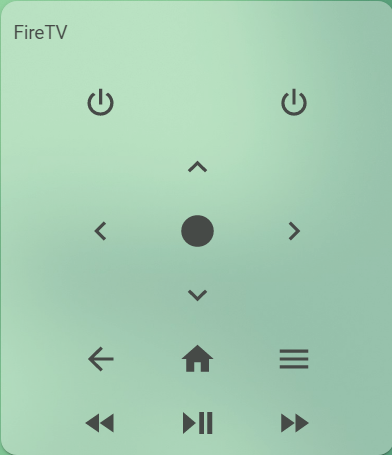

# FireTV Remote Card
📺 [FireTV Lovelace Card](https://github.com/custom-cards/roku-card) editited by mar_robHD

[![GitHub Release][releases-shield]][releases]
[![License][license-shield]](LICENSE.md)

![Project Maintenance][maintenance-shield]
[![GitHub Activity][commits-shield]][commits]
[](https://github.com/custom-components/hacs)
[![Discord][discord-shield]][discord]
[![Community Forum][forum-shield]][forum]

[![Twitter][twitter]][twitter]
[![Github][github]][github]

## Support

This card is for [Lovelace](https://www.home-assistant.io/lovelace) on [Home Assistant](https://www.home-assistant.io/) that display a [FireTV]() remote.

# NOTE: Firefox releases before 67 are not supported
https://twitter.com/_developit/status/1090364879377260544



## Options

| Name | Type | Requirement | Description
| ---- | ---- | ------- | -----------
| type | string | **Required** | `custom:firetv-card`
| entity | string | **Required** | `media_player` entity of Roku device
| remote | string | **Optional** | `remote` entity of Roku device. Default assume named like `entity`
| name | string | **Optional** | Card name
| theme | string | **Optional** | Card theme
| tv | boolean | **Optional** | If `true` shows volume and power buttons. Default `false`
| power | `service` | **Optional**| service to call when power button pressed
| back | `service` | **Optional**| service to call when back button pressed
| home | `service` | **Optional**| service to call when home button pressed
| up | `service` | **Optional**| service to call when up button pressed
| left | `service` | **Optional**| service to call when left button pressed
| select | `service` | **Optional**| service to call when select button pressed
| right | `service` | **Optional**| service to call when right button pressed
| down | `service` | **Optional**| service to call when down button pressed
| reverse | `service` | **Optional**| service to call when reverse button pressed
| play | `service` | **Optional**| service to call when play button pressed
| forward | `service` | **Optional**| service to call when forward button pressed
| volume_up | `service` | **Optional**| service to call when volume up button pressed
| volume_down | `service` | **Optional**| service to call when volume down button pressed
| volume_mute | `service` | **Optional**| service to call when volume mute button pressed

## `service` Options
| Name | Type | Requirement | Description
| ---- | ---- | ------- | -----------
| service | string | **Required** | Service to call
| service_data | string | **Optional** | Service data to use


## Installation

### HACS:

1.

Add this to your `HACS settings tab`:

```
https://github.com/marrobHD/firetv-card
```


### Step 1

Install `firetv-card` by copying `firetv-card.js` and `firetv-card-editor.js` from this repo to `<config directory>/www/firetv-card.js` on your Home Assistant instance.

**Example:**

```bash
wget https://raw.githubusercontent.com/marrobHD/firetv-card/master/firetv-card.js
wget https://raw.githubusercontent.com/marrobHD/firetv-card/master/firetv-card-editor.js
mv firetv-card* /config/www/
```

### Step 2

Link `firetv-card` inside your `ui-lovelace.yaml`.

```yaml
resources:
  - type: module
    url: /local/tv-card.js?v=1
```

### Step 3

Add a custom element in your `ui-lovelace.yaml`

```yaml
        type: 'custom:firetv-card'
        theme: Backend-selected
        tv: false
        entity: media_player.spotify
        name: FireTV
        power:
          service: androidtv.adb_command
          service_data:
            command: "input keyevent 26"
            entity_id: media_player.firetv
        back:
          service: androidtv.adb_command
          service_data:
            command: BACK
            entity_id: media_player.firetv
        home:
          service: androidtv.adb_command
          service_data:
            command: HOME
            entity_id: media_player.firetv
        down:
          service: androidtv.adb_command
          service_data:
            command: DOWN
            entity_id: media_player.firetv
        up:
          service: androidtv.adb_command
          service_data:
            command: UP
            entity_id: media_player.firetv
        left:
          service: androidtv.adb_command
          service_data:
            command: LEFT
            entity_id: media_player.firetv
        select:
          service: androidtv.adb_command
          service_data:
            command: "input keyevent 23"
            entity_id: media_player.firetv
        right:
          service: androidtv.adb_command
          service_data:
            command: RIGHT
            entity_id: media_player.firetv
        reverse:
          service: androidtv.adb_command
          service_data:
            command: input keyevent 89
            entity_id: media_player.firetv
        pauseplay:
          service: androidtv.adb_command
          service_data:
            command: input keyevent 85
            entity_id: media_player.firetv
        forward:
          service: androidtv.adb_command
          service_data:
            command: input keyevent 90
            entity_id: media_player.firetv
        menu:
          service: androidtv.adb_command
          service_data:
            command: MENU
            entity_id: media_player.firetv
```

### Example 1:

You can use the card in combination with the [browser mod integration](https://github.com/thomasloven/hass-browser_mod).
That means that you can create a ex. input_boolean which opens when you click on its icon:

```yaml
type: entities
entities:
  - entity: input_boolean.firetv
    name: FireTV
    tap_action:
      action: call-service
      service: browser_mod.popup
      service_data:
        style:
          border-radius: 20px
          '--ha-card-border-radius': 0px
        title: FireTV Fernbedienung
        card:
          type: 'custom:firetv-card'
          back:
            service: androidtv.adb_command
            service_data:
              command: BACK
              entity_id: media_player.firetv
          down:
            service: androidtv.adb_command
            service_data:
              command: DOWN
              entity_id: media_player.firetv
          entity: media_player.spotify
          forward:
            service: androidtv.adb_command
            service_data:
              command: input keyevent 90
              entity_id: media_player.firetv
          home:
            service: androidtv.adb_command
            service_data:
              command: HOME
              entity_id: media_player.firetv
          left:
            service: androidtv.adb_command
            service_data:
              command: LEFT
              entity_id: media_player.firetv
          menu:
            service: androidtv.adb_command
            service_data:
              command: MENU
              entity_id: media_player.firetv
          pauseplay:
            service: androidtv.adb_command
            service_data:
              command: input keyevent 85
              entity_id: media_player.firetv
          power:
            service: androidtv.adb_command
            service_data:
              command: input keyevent 26
              entity_id: media_player.firetv
          reverse:
            service: androidtv.adb_command
            service_data:
              command: input keyevent 89
              entity_id: media_player.firetv
          right:
            service: androidtv.adb_command
            service_data:
              command: RIGHT
              entity_id: media_player.firetv
          select:
            service: androidtv.adb_command
            service_data:
              command: input keyevent 23
              entity_id: media_player.firetv
          tv: false
          up:
            service: androidtv.adb_command
            service_data:
              command: UP
              entity_id: media_player.firetv
```


**suspended:Custom Updater:**

Add this to your `configuration.yaml`

```
custom_updater:
  card_urls:
    - https://raw.githubusercontent.com/marrobHD/firetv-card/master/tracker.json
```


[Troubleshooting](https://github.com/thomasloven/hass-config/wiki/Lovelace-Plugins)

[commits-shield]: https://img.shields.io/github/commit-activity/y/marrobHD/firetv-card.svg?style=for-the-badge
[commits]: https://github.com/marrobHD/firetv-card/commits/master
[discord]: https://discord.gg/ND4emRS
[discord-shield]: https://img.shields.io/discord/579704220970909717.svg?style=for-the-badge
[forum-shield]: https://img.shields.io/badge/community-forum-brightgreen.svg?style=for-the-badge
[forum]: https://community.home-assistant.io/t/lovelace-tv-remote-card/91476
[license-shield]: https://img.shields.io/github/license/marrobHD/firetv-card.svg?style=for-the-badge
[maintenance-shield]: https://img.shields.io/badge/maintainer-marrobHD-blue.svg?style=for-the-badge
[releases-shield]: https://img.shields.io/github/release/marrobHD/firetv-card.svg?style=for-the-badge
[releases]: https://github.com/marrobHD/firetv-card/releases
[twitter]: https://img.shields.io/twitter/follow/mar_robHD.svg?style=social
[github]: https://img.shields.io/github/followers/marrobHD.svg?style=social
